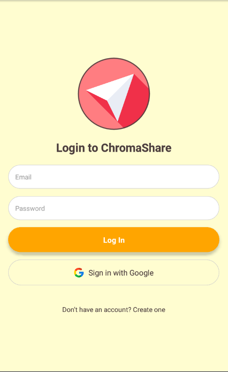
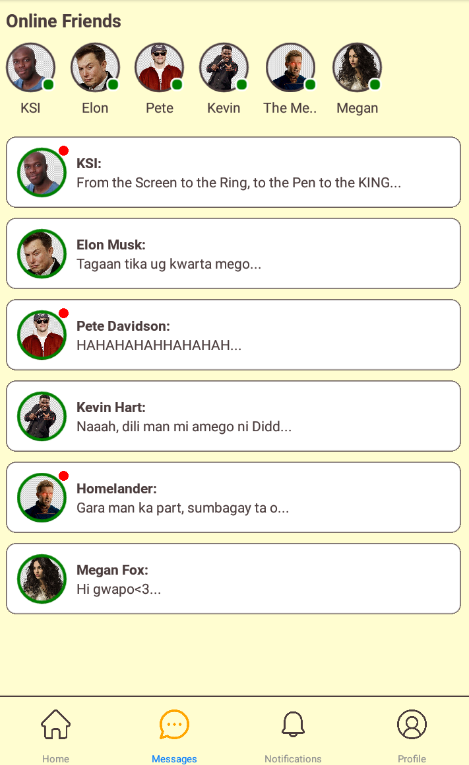

# CHROMASHARE
A Social Media Center.

# Features
* Share and Post!
* Add and follow people!
* Connect with friends!

# Course Overview
* Basic React Native Components
* Database Design using Appwrite
* User Registration & Authenticaiton
* Deployment

# Tech Stack
* React Native
* AppWrite
* HTML, CSS and JS

# Home Screen
  

# Log In Screen
  

# Sign Up Screen
  

# Tab Screens
* Home Tab
  

# Messages Tab
 

# Profile Tab
 

# Notifications Tab
 

