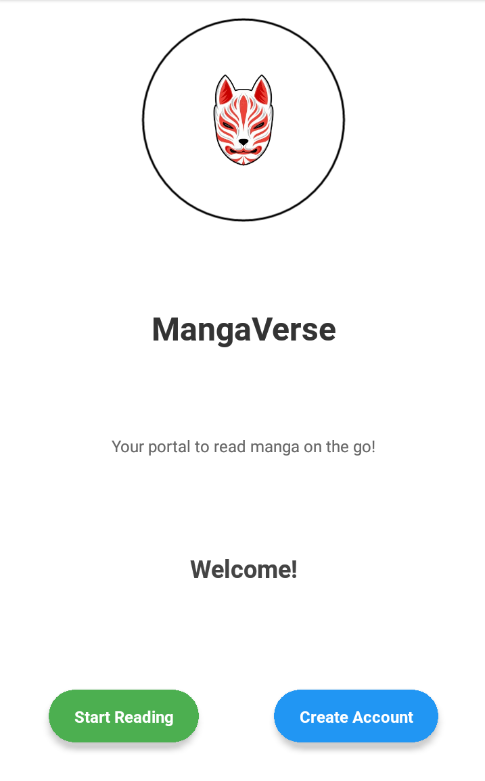

# MANGAVERSE
A Manga Mobile Reading App.

# Features
* Read Manga on the go!
* Keep Updated with your favorite Manga!
* Discover new Mangas!

# Course Overview
* Basic React Native Components
* Database Design using Appwrite
* User Registration & Authenticaiton
* Deployment

# Tech Stack
* React Native
* AppWrite
* HTML, CSS and JS

# Home Screen
  

# Log In Screen
  

# Sign Up Screen
  

# Tab Screens
* Home Tab
  

* Read Manga Tab
 

* Profile Tab
 

* Notifications Tab
 

